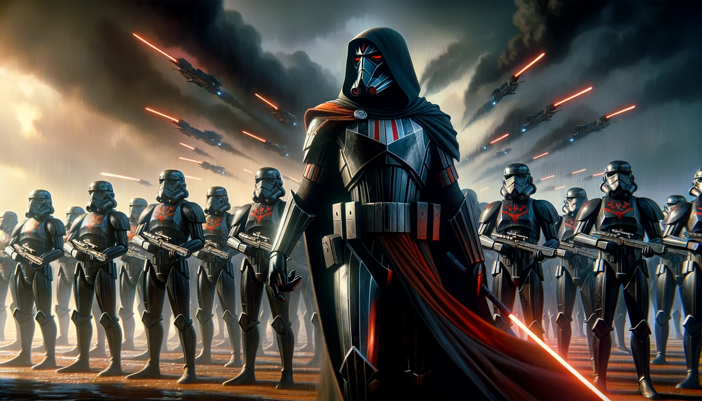

## 🧔🏻‍♂️ About Me:
Hello, I am Mathys Le Juez {Dark Juezu}, 24 years old.  My main hobby is programming video games, and I really love it.  Currently, I am in my fourth year at Epitech Berlin, pursuing a Master's degree in computer programming to obtain a certification in Unreal Engine 3D.  My other hobbies include:  - Programming in general.  - Playing video games.  - Motorsports.  - Golf.

## 🌐 Socials:

# 💻 Tech Stack:

- ## 🖥 Core Skills:
   
   
   
   
   
   
   
   
  
- ## 🖥 Additional Skills
   
   
   
   
   
   
   
   
   
   
   
   
   
   
   
   
   
   
   
- ## 🖥 Software:
   
   
   
   
   
   
   
   
   
   
# 🎮 GAME PROJECT:

<h1 align="center" style="color: red;"> Escape From The Hell </h1>

   

<h2 align="center">comming in 2024 January</h2>

   

  
<h1 align="center"> Unsuspected (Unreal Engine):</h1>

   [
](https://www.youtube.com/watch?v=2A5-clmECG4 "Demo Unsuspected")
    
# 🖥 Lien Readme Unsuspected:

