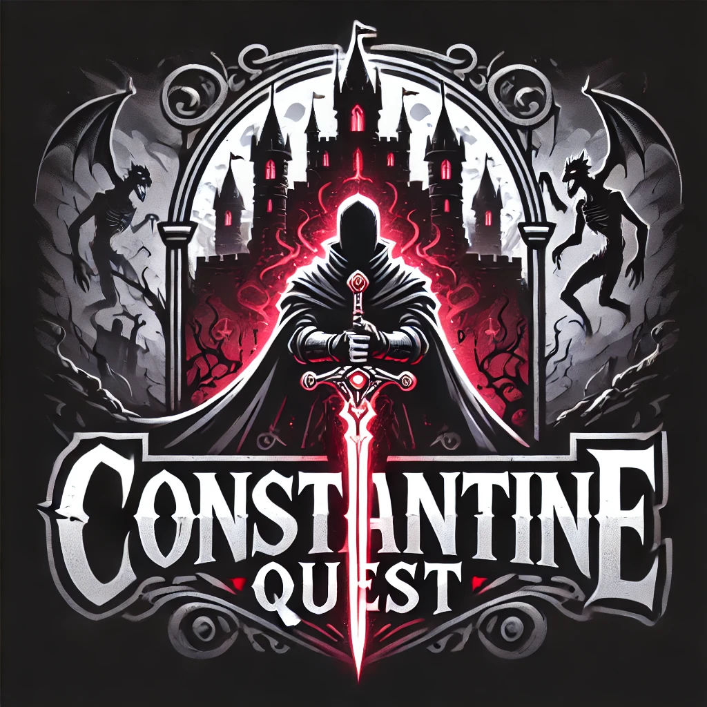
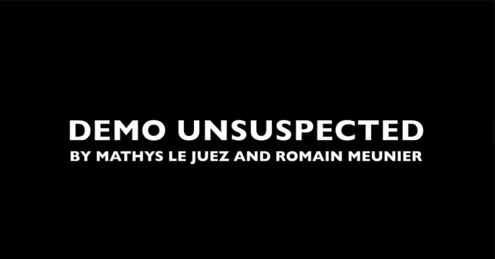

<!-- ================================================================
     README PROFIL PERSONNEL GITHUB
     Direction artistique : dashboard développeur gamifié
     RPG save-file × debug overlay — palette vert phosphore / cyan
     ================================================================ -->

  
  
  
  

<!-- ======================== LIENS RAPIDES ======================== -->

  
  
      <a href="https://le-juez-mathys.github.io/index.html">
    

---

## 💾 Fichier de sauvegarde chargé

> **[ FICHIER DE SAUVEGARDE CHARGÉ ]**
>
> **Mathys Le Juez** · 26 ans
> `LVL 26 — Co-founder & CEO, DERKLAN-STUDIO`
>
> Diplômé Master 2 à Epitech, expert en ingénierie logicielle, spécialisé en développement de jeux vidéo et de simulation militaire.
> Passionné par la création de jeux vidéo.
>
> `> quand je code pas, je joue.`

---

## ⚙️ Compétences — barres d'expérience

<!-- Barres en blocs unicode rendues via shields.io (100% fiable, pas de service tiers fragile) -->

<table>
  <tr>
    <td width="280"><strong>Unreal Engine / C++</strong> — gameplay & IA</td>
    <td></td>
  </tr>
  <tr>
    <td><strong>Unity 3D / C#</strong></td>
    <td></td>
  </tr>
  <tr>
    <td><strong>Réalité virtuelle</strong> (Vive / Quest)</td>
    <td></td>
  </tr>
  <tr>
    <td><strong>Lua / FiveM</strong></td>
    <td></td>
  </tr>
  <tr>
    <td><strong>Python / Data</strong> (NumPy, Pandas)</td>
    <td></td>
  </tr>
</table>

---

## 🧩 Stack technique

### ⚡ Core

  
  
  
  
  
  
  

### 🔧 Compétences additionnelles

  
  
  
  
  
  
  
  
  
  
  
  
  
  

### 🔀 Versioning & gestion

  
  
  
  

### 🖥 IDE & outils

  
  
  
  
  
  
  
  
  
  
  

---

## 🗒 Journal de quêtes — projets de jeux

<!-- Galerie horizontale — les images sont cliquables (→ trailer YouTube) -->
<!-- MODIFIER : Liens vidéo, images, noms, descriptions -->
<!-- AJOUTER : Copie un <td> pour ajouter un projet -->

<table>
  <tr>
    <td align="center" width="50%">
      
        
      <strong>Constantine Quest</strong>
       
      Action · Aventure
       
      
        
      
    </td>
    <td align="center" width="50%">
      
        
      <strong>Unsuspected</strong>
       
      Unreal Engine
       
      
        
      
    </td>
  </tr>
</table>

---

## ⚡ Centres d'intérêt

| | |
|---|---|
| 🎮 | Jeux vidéo — jouer & créer |
| 💻 | Programmation en général |

---

## 📊 Stats GitHub

<!-- Les stats utilisent les couleurs du dashboard : fond #0b100d, accent vert #4dff8e, cyan #5ad1ff -->

  
     

---

  <strong>DES JEUX FAITS AVEC PASSION</strong>
    
  

  © 2026 — Mathys Le Juez · Yetsu

