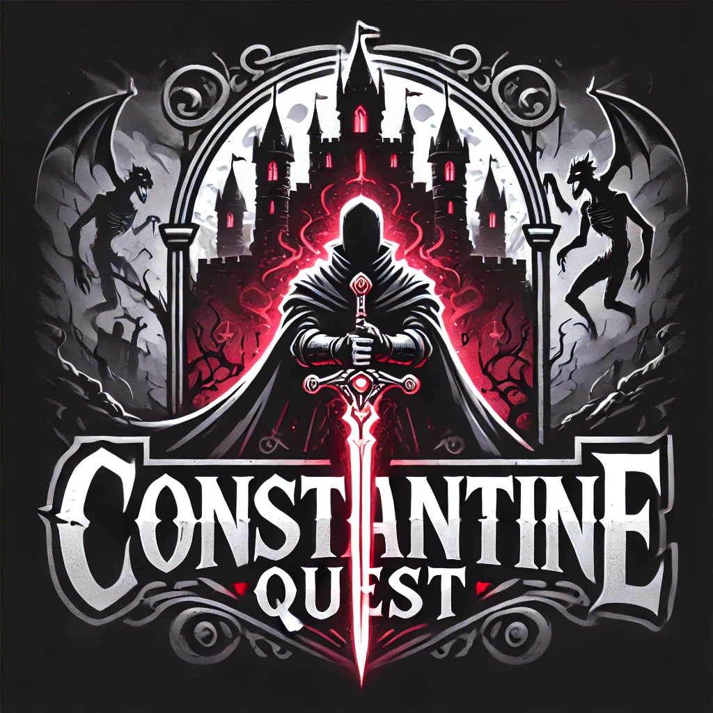
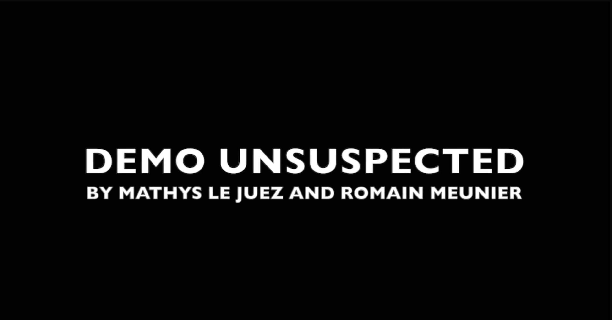

<!-- ================================================================
     README PROFIL — Mathys Le Juez
     DA : ONI MASQUÉ · rouge démon #ff1f3d / rouge sang #8b0000
     Fond #0d0d0d · label #220008 · texte #ffe5e9 · bordure #5c0011
     ================================================================ -->
 
<!-- ======================== BANNIÈRE ======================== -->

<!-- ======================== STATUS BAR ======================== -->

<!-- ======================== LIENS RAPIDES ======================== -->

&nbsp;

&nbsp;

&nbsp;

&nbsp;

 
<!-- ======================== REGISTRE ======================== -->
## ▼ `[ A propos de moi ]`
 
<table>
<tr>
<td>
**Mathys Le Juez** · 26 ans
`LVL 26 — Expert en ingénierie logicielle · Co-founder & CEO, DERKLAN STUDIO`
 
Diplômé d'un **Master 2 Epitech**, **expert en ingénierie logicielle**.
 

</td>
<td align="center" width="280">
 
 
 

</td>
</tr>
</table>
---
 
 
<!-- ======================== XP BARS ======================== -->
## ▼ Compétences — jauges de puissance
 

<table>
     <tr>
<td width="300"><strong>C++</strong> — applicatif & Unreal Engine/sub></td>
<td></td>
</tr>
<tr>
<td width="300"><strong>C#</strong> — Unity</td>
<td></td>
</tr>
<tr>
<td><strong>Python / Data</strong> (NumPy, Pandas)</td>
<td></td>
</tr>
<tr>
<td><strong>Réalité virtuelle</strong> (Vive / Quest)</td>
<td></td>
</tr>
<tr>
<td><strong>Lua / FiveM</strong></td>
<td></td>
</tr>
</table>

---
 
<!-- ======================== ARSENAL ======================== -->
## ▼ Arsenal technique
 
### Langages & ingénierie
 

### Moteurs de jeu
 

<strong>▼ Armes secondaires</strong> (cliquer pour déplier)

 

**Versioning & gestion**
 

**IDE & outils**
 

---
 
<!-- ======================== CODEWARS ======================== -->
## ▼ Dojo Codewars
 

  
 

#### Progression vers le rang suivant
 
<!-- CODEWARS-PROGRESS:START -->

 6 / 20 points de rang · encore 14 avant 7 kyu

<!-- CODEWARS-PROGRESS:END -->
 
#### Dernières cibles abattues
 
<!-- CODEWARS:START -->
| Kata | Niveau | Langage | Validé le |
|------|:------:|:-------:|:---------:|
| [Multiply](https://www.codewars.com/kata/50654ddff44f800200000004) | `8 kyu` | C++ | 2026-09-17 |
| [Jenny's secret message](https://www.codewars.com/kata/55225023e1be1ec8bc000390) | `8 kyu` | C++ | 2026-09-16 |
| [Remove String Spaces](https://www.codewars.com/kata/57eae20f5500ad98e50002c5) | `8 kyu` | C++ | 2026-09-16 |
| [Convert a string to an array](https://www.codewars.com/kata/57e76bc428d6fbc2d500036d) | `8 kyu` | C++ | 2026-09-16 |
<!-- CODEWARS:END -->
 
---
 
<!-- ======================== CONTRATS ======================== -->
## ▼ Contrats — jeux vidéo
 
<!-- Les vignettes sont cliquables → trailer YouTube -->
<!-- AJOUTER un projet : dupliquer un <td> -->
 

<table>
<tr>
<td align="center" width="50%">

 
<strong>Constantine Quest</strong> · Action / Aventure
 

</td>
<td align="center" width="50%">

 
<strong>Unsuspected</strong> · Unreal Engine
 

</td>
</tr>
</table>

---
 
<!-- ======================== STATS ======================== -->
## ▼ Traces laissées
 

<!-- ======================== NOW PLAYING ======================== -->
### ▼ En écoute
 

<!-- ======================== SNAKE ======================== -->

<!-- ======================== FOOTER ======================== -->

© 2026 — Mathys Le Juez · Yetsu

